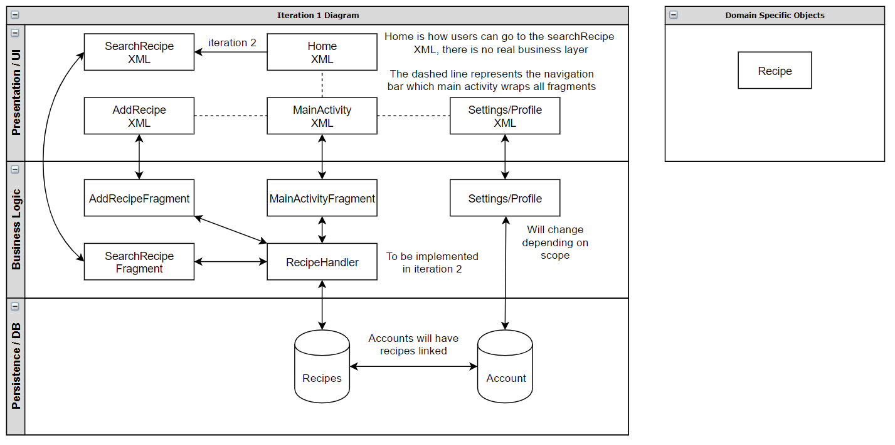

# Architecture

**Directory**

## Iteration 1 Diagram

## Presentation/UI Layer
[MainActivity](https://code.cs.umanitoba.ca/comp3350-winter2020/pocketchef-5/blob/master/PocketChef/app/src/main/res/layout/activity_main.xml)
- The main activity is responsible for setting up the navigation bar and immediately going to the home fragment

[Home](https://code.cs.umanitoba.ca/comp3350-winter2020/pocketchef-5/blob/master/PocketChef/app/src/main/res/layout/fragment_home.xml)
- the home view which is the view the users will first see when they open the app. Can search in home or select other views through navigation bar.

[AddRecipe](https://code.cs.umanitoba.ca/comp3350-winter2020/pocketchef-5/blob/master/PocketChef/app/src/main/res/layout/fragment_add_recipe.xml)
- The view screen where users can add their own recipes to the application.

[Settings/ProfileXML](https://code.cs.umanitoba.ca/comp3350-winter2020/pocketchef-5/blob/master/PocketChef/app/src/main/res/layout/fragment_user_profile.xml)
- Undecided in iteration 1. Will either be a user profile or a settings view.

## Business Logic
[fragments](https://code.cs.umanitoba.ca/comp3350-winter2020/pocketchef-5/tree/master/PocketChef/app/src/main/java/net/team5/pocketchef/ui/)
- Undecided in iteration 1. Will either have business layer logic for each respective fragment, or a handler will be set for the fragments.

[RecipeHandler]"Link N/A"
- Will handle all the logic regarding the fragments interacting with the database.

[settings/profile]"Link N/A"
- Undecided in iteration 1. Will handle the logic of settings/profile and interact with DB

## Persistence/DB
[Recipes]"Link N/A"
- Will store all the recipes

[Account]"Link N/A"
- Undecided in iteration 1. Will store all the account settings. 

## Domain Specific Objects
[Recipe](https://code.cs.umanitoba.ca/comp3350-winter2020/pocketchef-5/blob/master/PocketChef/app/src/main/java/net/team5/pocketchef/business/objects/Recipe/Recipe.java)
- The recipe object